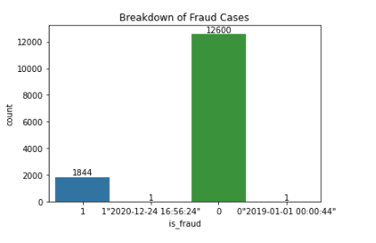
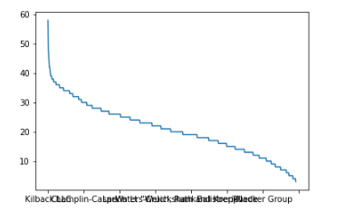
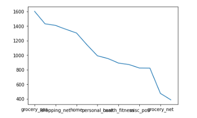
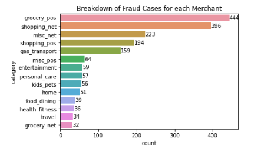
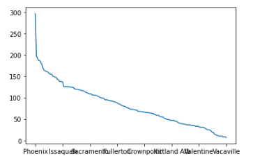
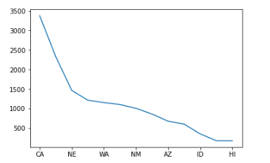
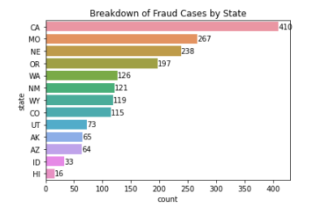
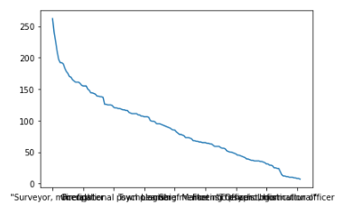
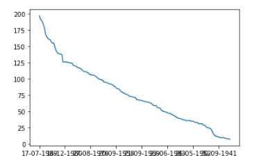
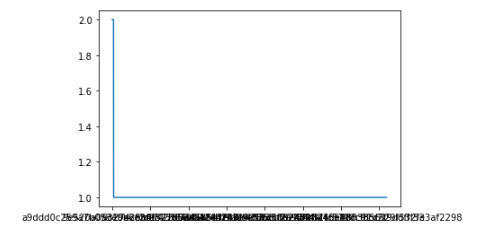

# Business Problem

A financial services company wants to expand its business portfolio by entering the credit card business.  The company executives also recognize that fraud is a paramount issue.  As a result, the firm tasks KBO Analytics with the following:

- Create a model prototype to detect credit card fraud
- Identify characteristics that signal whether or not credit card fraud will take place

# Data Understanding

The data for examing the aforementioned problem comes from the following source: [Credit Card Fraud Data](https://www.kaggle.com/datasets/neharoychoudhury/credit-card-fraud-data/data)

Before beginning to identify any trends with customers that churn, I want to examine and become familiar with the dataset. I will conduct exploratory data analysis in order to understand the dataset attributes, which includes, but not limited to the following:

1. Number of Columns
2. Number of Rows
3. Column Names
4. Format of the data in each column

I created a Pandas Dataframe.  The Dataframe contains 14,446 rows of data.  The Dataframe contains 15 columns, which are the following:
    
1. Transaction Date and Time - (*fraud_df['trans_date_trans_time']*)
2. Merchant Name - (*fraud_df['merchant']*)
3. Category of Merchant - (*fraud_df['category']*)
4. Amount of Transaction - (*fraud_df['amt']*)
5. City of Credit Card Holder - (*fraud_df['city']*)
6. State of Credit Card Holder - (*fraud_df['state']*)
7. Latitute Location of Purchase - (*fraud_df['lat']*)
8. Longitude Location of Purchase - (*fraud_df['long']*)
9. Credit Card Holder's City Population - (*fraud_df['city_pop']*)
10. Job of Credit Card Holder - (*fraud_df['job']*)
11. Date of Birth of Credit Card Holder - (*fraud_df['dob']*)
12. Transaction Number - (*fraud_df['trans_num']*)
13. Latitude of Location of Merchant - (*fraud_df['merch_lat']*)
14. Longitude Location of Merchant - (*fraud_df['merch_long']*)
15. Whether Transaction is Fraud or Not - (*fraud_df['is_fraud']*)   

## Missing Data

I utilized the following code - *fraud_df.isna().sum()* - to check for missing values in each column.  There are no missing values in any of the columns.

## Duplicate Data

I utilized the following code - *fraud_df.duplicated().sum()* - to understand how many duplicated rows are in the dataframe.  There is a total of 63 duplicate rows.

## Examining Columns

I am going to conduct additional exploratory analysis for the following columns:
    
- Whether Transaction is Fraud or Not
- Merchant Name
- Category of Merchant
- City of Credit Card Holder
- State of Credit Card Holder
- Job of Credit Card Holder
- Date of Birth of Credit Card Holder
- Transaction Number

The following column - Whether Transaction is Fraud or Not - is the target.  This is the column that captures the non-fradulent and fradulent transactions.

The remaining columns are categorical.  I want to examine the distribution of the data within each column.

### Whether Transaction is Fraud or Not

**Observations | Whether Transaction is Fraud or Not**  

I utilized the following code - *fraud_df['is_fraud'].value_counts()* - to understand how many cases of fraud exist within the dataframe.

There 12,600 cases of no fraud.  There are 1,844 cases of fraud.  As expected, there is a class imbalance of fraud within the dataset.  In regards to modeling, accuracy will not be an appropriate metric to determine model performance.

I want to note there is a row with the following entry - *0"2019-01-01 00:00:44"*.  I am assuming this is a non-fradulent case in which the transaction date and time was incorporated.  I will remove the timestamp during the data cleaning phase.

I also want to note there is a row with the following entry - *1"2020-12-24 16:56:24"*.  I am assuming this is a fradulent case in which the transaction date and time was incorporated.  I will remove the timestamp during the data cleaning phase.

A bar chart that breaks down the non-fradulent and fradulent cases is below.

### Merchant Name

**Observations | Merchant Name** 

I utilized the following code - *fraud_df['merchant'].nunique()* - to identify the number of unique values in the Merchant column.  There are 693 different values in the Merchant column.  

I utilized the following code - fraud_df['merchant'].value_counts() - to understand the distribution of the categories within the Merchant column.  The top 5 values with their respective counts are the following:
    
- Kilback LLC - 58
- Cormier LLC - 48
- Kutch and Sons - 46
- Rau and Sons - 44
- Kiehn-Emmerich - 42
    
Based on the observations, there is a high degree of cardinality, or many unique values, within the Merchant column.
    
I utilized the following code - *fraud_df['merchant'].value_counts().plot()* - to provide a visualization of the high cardinality, which is below.

### Category (of Merchant)

**Observations | Category (of Merchant)**

I utilized the following code - *fraud_df['category'].nunique()* - to identify the number of unique values in the Category column.  There are 14 different values in the Category column.  

I utilized the following code - fraud_df['category'].value_counts() - to understand the distribution of the values within the Category column.  The top 5 values with their respective counts are the following:
    
- *grocery_pos* - 1602
- *gas_transport* - 1430
- *shopping_net* - 1408
- *shopping_pos* - 1354
- *home* - 1304
    
Based on the observations, there is a low degree of cardinality, or few unique values, within the Category column.
    
I utilized the following code - *fraud_df['category'].value_counts().plot()* - to provide a visualization of the low cardinality, which is below.

I created a dataframe that only has the fradulent credit card transactions.  The top five merchant values that have fradulent transactionss are the following:

- *grocery_pos* - 444
- *shopping_net* - 396
- *misc_net* - 223
- *shopping_pos* - 194
- *gas_transport* - 159

Upon observing the data, I see there are opportunities to group some of the merchant values together.  For example, *food_dining* category can become part of the *entertainment* category.

I also created a bar chart to represent which merchant values have the most fradulent cases.  The bar chart is below.

### City of Credit Card Holder

**Observations | City of Credit Card Holder**

I utilized the following code - *fraud_df['city'].nunique()* - to identify the number of unique values in the City column.  There are 176 different values in the City column.  

I utilized the following code - fraud_df['city'].value_counts() - to understand the distribution of the values within the City column.  The top 5 values with their respective counts are the following:
    
- Phoenix - 297
- Centerview - 197
- Orient - 192
- Sutherland - 187
- Fort Washakie - 187
    
Based on the observations, there is a high degree of cardinality, or many unique values, within the City column.
    
I utilized the following code - *fraud_df['city'].value_counts().plot()* - to provide a visualization of the high cardinality, which is below.

### State of Credit Card Holder

**Observations | State of Credit Card Holder**

I utilized the following code - *fraud_df['state'].nunique()* - to identify the number of unique values in the State column.  There are 13 different values in the State column.  

I utilized the following code - fraud_df['state'].value_counts() - to understand the distribution of the values within the State column.  The top 5 values with their respective counts are the following:
    
- CA - 3375
- MO - 2329
- NE - 1460
- OR - 1211
- WA - 1150
    
Based on the observations, there is a low degree of cardinality, or few unique values, within the State column.
    
I utilized the following code - *fraud_df['state'].value_counts().plot()* - to provide a visualization of the low cardinality, which is below.

I leveraged the dataframe that only has the fradulent credit card transactions.  The top five states that have fradulent transactionss are the following:

- CA - 410
- MO - 267
- NE - 238
- OR - 197
- WA - 126

Upon observing the data, I see there are opportunities to group some of the states together.  For example, I can group the states into the following categories: West, Southwest, and Midwest.  However, I am inclined to maintain California (CA), Alaska (AK), and HI (Hawaii) as standalone states.

I also created a bar chart to represent which states have the most fradulent cases.  The bar chart is below.

### Job of Credit Card Holder

**Observations | Job of Credit Card Holder**

I utilized the following code - *fraud_df['job'].nunique()* - to identify the number of unique values in the Job column.  There are 163 different categories in the Job column.  

I utilized the following code - fraud_df['job'].value_counts() - to understand the distribution of the values within the Job column.  The top 5 values with their respective counts are the following:
    
- Surveyor, minerals - 262
- Surveyor, land/geomatics - 240
- Land/geomatics surveyor - 225
- Insurance broker - 209
- Electronics engineer - 197
    
Based on the observations, there is a high degree of cardinality, or many unique values, within the Job column.
    
I utilized the following code - *fraud_df['job'].value_counts().plot()* - to provide a visualization of the high cardinality, which is below.

### Date of Birth of Credit Card Holder

I utilized the following code - *fraud_df['dob'].nunique()* - to identify the number of unique values in the Date of Birth column.  There are 187 different values in the Date of Birth column.  

I utilized the following code - fraud_df['dob'].value_counts() - to understand the distribution of the categories within the Date of Birth column.  The top 5 values with their respective counts are the following:
    
- July 17th, 1989 - 197
- June 21st, 1978 - 192
- October 24th, 1981 - 190
- February 11th, 1982 - 187
- October 28th, 1987 - 183
    
Based on the observations, there is a high degree of cardinality, or many unique values, within the Date of Birth column.
    
I utilized the following code - *fraud_df['dob'].value_counts().plot()* - to provide a visualization of the high cardinality, which is below.

### Transaction Number

**Observations | Transaction Number**

I utilized the following code - *fraud_df['trans_num'].nunique()* - to identify the number of unique values in the Transaction Number column.  There are 14383 different values in the Transaction Number column.  

I utilized the following code - *fraud_df['trans_num'].value_counts()* - to understand the distribution of the values within the Job column.
    
Based on the observations, this column has the highest degree of cardinality in comparison to all of the other columns in the dataset.  This is expected.  A transaction number is a unique identifier that is specific for a singular transaction.  
    
I utilized the following code - *fraud_df['trans_num'].value_counts().plot()* - to provide a visualization of the high cardinality, which is below.

# Data Preparation

I have completed the Data Understanding stage.  I will transition to preparing the data for modeling via the following stages:

**Duplicate Data**

- Remove Duplicates

**Columns to Drop**

- Remove the Merchant column, or *fraud_df['merchant']*
- Remove the City of Credit Card Holder column, or *fraud_df['city']*
- Remove the Job of Credit Card Holder column, or *fraud_df['job']*
- Remove the Date of Birth column, or *fraud_df['dob']*
- Remove the Transaction Number column, or *fraud_df['trans_num']*

**Reclassify Data Entries in the Category (of Merchant) column**

- For the rows in which there is an entry of *food_dining*, reclassify to *entertainment*

**Reclassify Data Entries in the 'Whether Transaction is Fraud or Not' Column**

- For the row in which there is an entry of *0"2019-01-01 00:00:44"*, reclassify it to 0
- For the row in which there is an entry of *1"2020-12-24 16:56:24"*, reclassify it to 1
- Change the data type of the column from *string* to *integer*

**State of Credit Card Holder**

- For the rows in which *CA* is listed, reclassify to *California*
- Reclassify others states into US regions (i.e. - West, Southwest, and Midwest)
- Rename state column as region

**Transaction Date | Transaction Time Column**

- Create a hour column based on the Transaction Date | Transaction Time Column
- Create a month column based on the Transaction Date | Transaction Time Column
- Create a year column based on the Transaction Date | Transaction Time Column

## Duplicate Data

I utilized the following code - *fraud_df.drop_duplicates(inplace=True)* - to remove the duplicates from the *fraud_df* dataframe.  There were originally 14,446 rows of data.  There are currently 14,383 rows of data.

## Columns to Drop

I utilized the following code - *fraud_df.drop(columns=['merchant', 'city', 'job', 'trans_num'], inplace=True)* to remove the following columns:

- Merchant - *fraud_df['merchant']*
- City of Credit Card Holder - *fraud_df['city']*
- Date of B*fraud_df['dob']*
- *fraud_df['job']*
- *fraud_df['trans_num']* 

Due to high cardinality, I removed the aforementioned columns.  There were originally fifteen columns in the dataframe.  There are currently 10 columns in the dataframe.

## Category (of Merchant) Column

I utilized the following code - *fraud_df['category'] = fraud_df['category'].str.replace('food_dining', 'entertainment')* - to reclassify the 'food_dining' values into 'entertainment'.  There were originally 949 credit card transactions for entertainment.  There are currently 1,818 credit card transaction values for entertainment.  Bar chart is below to display the breakdown.

## Whether Transaction is Fraud or Not Column

The data cleaning and preparation for the Fraud column is complete.  There are currently 12,601 cases of no fraud, and 1,782 cases of Fraud.  A breakdown is shown via bar chart below.

## State of Credit Card Holder

I have completed grouping the states into regions based on the following source: [National Geographic United States Regions](https://education.nationalgeographic.org/resource/united-states-regions/).  I decided to maintain California as its own since it is the state with the most credit card transactions.

I also renamed the state column as region.  The bar chart below provides a breakdown of credit card transactions by region.

## Transaction Date | Transaction Time Column

### Creating Hour Column

I have created a new column titled *fraud_df['hour']*.  An interesting observation is that the number of credit card transactions increases as midnight approaches.  The bar chart below reflects the breakdown of credit card transactions by the hour.

Based on the aforementioned bar chart - *Breakdown of Top 10 Credit Card Transactions by Hour* - I assumed that most of the fraud cases took place as midnight approached.

To investigate this, I utilized the dataframe I created that only contained the fraud cases.  It is called *all_fraud_cases*.  Based on the following bar chart - *Breakdown of Fraud Cases by Top 10 Hour Time Slots* - it seems my assumption is true.  As midnight approaches, the number of fraud cases increases.

### Creating Month Column

I have created a new column titled *fraud_df['month']*.  An interesting observation is that the number of credit card transactions increases around the months of December and January.  This time of the year is associated with the holidays (i.e. - Christmas).  

The bar chart below reflects the breakdown of credit card transactions by months of the year.

Based on the aforementioned bar chart - *Breakdown of Credit Card Transactions by Month* - I assumed that most of the fraud cases took place around December and January.

To investigate this, I utilized the dataframe I created that only contained the fraud cases.  Based on the following bar chart - *Breakdown of Fraud Cases by Month* - it seems my assumption is not entirely true.  In comparison to the other months, January had the highest number of fraud cases.  The number of fraud cases in January is 223.  

December ranked third to last in respect to the number of fraud cases.  The number of fraud cases is 138.

### Creating Year Column

In respect to year, the credit card transactions are only broken down by two years - 2019 and 2020.  In other words, the dataset only has data for 2019 and 2020.  I will drop the column from the dataframe.  Interim, there is a bar chart below that provides a breakdown of credit card transactions by year.

### Dropping the Transaction Date | Transaction Time Column

I utilized the following code - *fraud_df.drop(columns='trans_date_trans_time', inplace=True)* - to drop the Transaction Date | Transaction Time Column.

# Modeling

I have completed the Data Preparation stage.  I will use three sets of models for detecting credit card fraud.  The algorithms are listed below:

- Decision Tree
- Random Forest
- Gradient Boosting

I utilized the following code - *X = pd.get_dummies(X, drop_first=True)* - to create dummy variables for the categorical variables.

There are a total of 24 columns in the X variable.  This is due to the Category of Merchant column containing 14 unique values, which are the following:

- *entertainment*     
- *grocery_pos*       
- *gas_transport*     
- *shopping_net*      
- *shopping_pos*      
- *home*              
- *kids_pets*        
- *personal_care*      
- *health_fitness*     
- *misc_pos*           
- *misc_net*           
- *grocery_net*        
- *travel*

In addition, the Region column contains 5 different unique values, which are the following:

- California
- Midwest
- Southwest
- West

## Baseline Decision Tree Model

### Baseline Decision Tree Model | Conclusion

I have concluded creating a Baseline Decision Tree model.

When the baseline model utilizes the training data, the evaluation metrics are the following:

- Precision: 100.0%
- Recall: 100.0%
- Accuracy: 100.0%
- F1 Score: 100.0%
    
When the baseline model utilizes the test data, the evaluation metrics are the following:

- Precision: 91.4%
- Recall: 91.7%
- Accuracy: 97.9%
- F1 Score: 91.6%
      
This model has slight overfitting due to the discrepancies in the training and test metrics.

I also want to point out that recall wil be the key model evaluation metric.

Accuracy is not appropriate since there is a class imbalance.  It is ideal to improve precision.  Improving model precision will lower the amount of false positives.  In the case of credit card fraud, a false positive is the model stating that an individual committed credit card fraud; however, in reality, the individual did not commit credit card fraud.

Improving model recall will lower the amount of false negatives.  In the case of credit card fraud, a false negative is the model stating that an individual did not commit credit card fraud; however, in reality, the individual did commit credit card fraud.

Provided the aforementioned context, a false negative is more detrimental than a false positive.  As a result, recall will be the key model evaluation metric.

I am going to proceed by tuning the decision tree classifier.

## Tuning the Baseline Decision Tree Model

There are multiple variables in which I want to tune the decision tree classifier. I will currently focus on the following:

- Maximum Tree Depth (*max_depth*) - depth of the decision tree, the maximum number of splits a decision tree can have before continue to grow
- Minimum Sample Split (*min_samples_split*) - minimum number of samples required to split an internal node
- Minimum Sample Leafs (*min_samples_leaf*) - minimum number of samples for a leaf node, or terminal node
- Maximum Features (*max_features*) - maximum number of features considered for making a split at a tree node

The optimal tree depth is approximately 4.  After a tree depth of 4, the AUC scores for the train and test data begin to bifurcate.

The optimal minimum sample split is approximately 0.1.  The AUC scores for the train and test data tend to move together; however, the AUC scores for the train and test data continue to decrease.

The optimum minimum sample leaf is approximately 0.10.  The AUC scores associated with the train and test data tend to remain converged; however, the AUC scores for the train and test data continue to decrease.

There is no optimal value for Maximum Features.  The AUC scores for the train and test data remain disparate throughout the graph.

I have found the approximate optimal values for Maximum Tree Depth, Minimum Sample Split, and Minimum Sample Leaf. I will create a pipeline and grid search cv that will not only incorporate the aforementioned values, but vary the Decision Tree model criterion and Decision Tree class weight.

I have created the pipeline and grid search object.  When I utilized the following code - *grid_clf_tune.best_params_* - the optimal values are the following:

- class weight: balanced
- criterion: entropy
- maximum depth: 3
- minimum samples leaf: 0.15
- minimum samples split: 0.1

### Tuned Decision Tree Model | Conclusion

**Baseline Decision Tree Model**

When the baseline model utilizes the training data, the evaluation metrics are the following:

- Precision: 100.0%
- Recall: 100.0%
- Accuracy: 100.0%
- F1 Score: 100.0%

When the baseline model utilizes the test data, the evaluation metrics are the following:

- Precision: 91.4%
- Recall: 91.7%
- Accuracy: 97.9%
- F1 Score: 91.6%

**Tuned Decision Tree Model**

When the tuned model utilizes the training data, the evaluation metrics are the following:

- Precision: 35.1%
- Recall: 95.0%
- Accuracy: 77.8%
- F1 Score: 51.3%

When the baseline model utilizes the test data, the evaluation metrics are the following:

- Precision: 34.9%
- Recall: 94.3%
- Accuracy: 77.1%
- F1 Score: 51.0%

**Conclusions**

Recall is the key model evaluation metric.  The Tuned Decision Tree Model outperforms the Baseline Decision Tree Model.  In addition, overfitting has been reduced with the Tuned Decision Tree Model.  

The Tuned Decision Tree model's evaluation metrics - precision, accuracy, and F1 - decreased relative to the Baseline Decision Tree Model's precision, accuracy, and F1 scores.  This is evidenced by the Tuned Decision Tree Model's ROC curve and precision-recall curve.  I consider the aforementioned relative decrease a trade-off.

The Tuned Decision Tree Model is the best model so far.

I will proceed with created another set of models via Random Forest algorithm.

## Baseline Random Forest Model

### Baseline Random Forest Model | Conclusion

I have concluded creating a Baseline Decision Tree model.

When the baseline model utilizes the training data, the evaluation metrics are the following:

- Precision: 100.0%
- Recall: 100.0%
- Accuracy: 100.0%
- F1 Score: 100.0%

When the baseline model utilizes the test data, the evaluation metrics are the following:

- Precision: 95.5%
- Recall: 89.2%
- Accuracy: 98.1%
- F1 Score: 92.2%

This model has slight overfitting due to the discrepancies in the training and test metrics.

I am going to proceed by tuning the random forest model.

## Tuned Random Forest Model

There are multiple variables in which I want to tune the random forest model. I will currently focus on the following:

- Maximum Tree Depth (max_depth) - depth of the decision tree, the maximum number of splits a decision tree can have before continue to grow
- Minimum Sample Split (min_samples_split) - minimum number of samples required to split an internal node
- Minimum Sample Leafs (min_samples_leaf) - minimum number of samples for a leaf node, or terminal node
- Maximum Features (max_features) - maximum number of features considered for making a split at a tree node

The optimal maximum tree depth is approximately 3.  After a tree depth of approximately 3, the AUC scores for the test and train data start to bifurcate.

The optimal minimum sample split is approximately 0.1.  After approximately 0.1, the AUC scores for the test and train data remain converged; however, the AUC scores for the train and test data decrease throughout the graph.

The optimal minimum sample leaf is approximately 0.10.  The AUC scores for the training and test data are together throughout the graph; however, the AUC scores for the training and test data decreases.

The optimal minimum sample leaf is approximately 0.10.  The AUC scores for the training and test data are together throughout the graph; however, the AUC scores for the training and test data decreases.

There is no optimal maximum features identified in the graph.  The AUC scores for the training and test data are bifurcated throughout the graph.

I have found the approximate optimal values for Maximum Tree Depth, Minimum Sample Split, and Minimum Sample Leafs. I will create a pipeline and grid search cv that will not only incorporate the aforementioned values, but vary the Random Forest Model criterion and class weight.

I have created the pipeline and grid search object. When I utilized the following code - grid_clf_tune.best_params_ - the optimal values are the following:

- class weight: balanced
- criterion: entropy
- maximum depth: 1
- minimum samples leaf: 0.25
- minimum samples split: 0.5

### Tuned Random Forest Model | Conclusion

**Baseline Random Forest Model**

When the baseline model utilizes the training data, the evaluation metrics are the following:

- Precision: 100.0%
- Recall: 100.0%
- Accuracy: 100.0%
- F1 Score: 100.0%

When the baseline model utilizes the test data, the evaluation metrics are the following:

- Precision: 95.5%
- Recall: 89.2%
- Accuracy: 98.1%
- F1 Score: 92.2%

**Tuned Random Forest Model**

When the tuned model utilizes the training data, the evaluation metrics are the following:

- Precision: 30.2%
- Recall: 76.7%
- Accuracy: 75.3%
- F1 Score: 43.3%

When the baseline model utilizes the test data, the evaluation metrics are the following:

- Precision: 31.4%
- Recall: 77.6%
- Accuracy: 75.8%
- F1 Score: 44.7%

**Conclusions**

The Tuned Random Forest Model minimized the overfitting.  However, the Baseline Random Forest Model outperforms the Tuned Random Forest Model.  As a reminder, recall is the key model evaluation metric.

I will proceed with created another set of models via Gradient Boosting algorithm.

## Baseline Gradient Boosting Model

### Baseline Gradient Boosting Model

I have concluded creating the Baseline Gradient Boosting Model.

When the baseline model utilizes the training data, the evaluation metrics are the following:

- Precision: 96.2%
- Recall: 91.1%
- Accuracy: 98.5%
- F1 Score: 93.6%

When the baseline model utilizes the test data, the evaluation metrics are the following:

- Precision: 94.6%
- Recall: 89.3%
- Accuracy: 98.0%
- F1 Score: 91.9%

There is minimal overfitting with this model.

I will proceed with tuning the Gradient Boosting Model.

## Tuning Gradient Boosting Model

There are multiple variables in which I want to tune the random forest model. I will currently focus on the following:

- Maximum Tree Depth (max_depth) - depth of the decision tree, the maximum number of splits a decision tree can have before continue to grow
- Minimum Sample Split (min_samples_split) - minimum number of samples required to split an internal node
- Minimum Sample Leafs (min_samples_leaf) - minimum number of samples for a leaf node, or terminal node
- Maximum Features (max_features) - maximum number of features considered for making a split at a tree node

The optimal maximum tree depth is approximately 2.  After a tree depth of 2, the AUC scores of the test data and training data start to bifurcate.

There is no optimal minimum sample split identified.  The AUC scores for the training data and test data are bifurcated throughout the graph.

The optimal minimum sample leaf is approximately 0.10.  As the number of minimum sample leafs increase via the graph, the AUC scores for the training data and test data move together.  However, the scores for the training data and test data decreases.

There is no optimal maximum features identified.  Throughout the graph, the AUC scores for the training and test data are bifurcated.

I have found the approximate optimal values for Maximum Tree Depth and Minimum Sample Leaf. I will create a pipeline and grid search cv that will not only incorporate the aforementioned values, but vary the Gradient Boosting Model criterion, loss, learning rate, and minimum weight fraction leaf.

I have created the pipeline and grid search object. When I utilized the following code - grid_gdb_tune.best_params_ - the optimal values are the following:

- criterion: friedman mse
- learning rate: 0.2
- loss: log loss
- maximum depth: 4
- minimum sample leaf: 0.05
- minimum weight fraction: 0.0

### Tuned Gradient Boosting Model | Conclusion

**Baseline Gradient Boosting Model**

When the baseline model utilizes the training data, the evaluation metrics are the following:
    
- Precision: 96.2%
- Recall: 91.1%
- Accuracy: 98.5%
- F1 Score: 93.6%
    
When the baseline model utilizes the test data, the evaluation metrics are the following:

- Precision: 94.6%
- Recall: 89.3%
- Accuracy: 98.0%
- F1 Score: 91.9%
    
**Tuned Gradient Boosting Model**

When the tuned model utilizes the training data, the evaluation metrics are the following:

- Precision: 95.4%
- Recall: 92.9%
- Accuracy: 98.6%
- F1 Score: 94.1%
    
When the tuned model utilizes the test data, the evaluation metrics are the following:
    
- Precision: 92.5%
- Recall: 91.0%
- Accuracy: 97.9%
- F1 Score: 91.7%

**Conclusions**

There is minimal overfitting with the Tuned Gradient Boosting Model.  In addition, the Tuned Grading Boosting Model performs better than the Baseline Gradient Boosting Model.  

## Modeling | Conclusion

The key model evaluation metric is recall.  The recall values for each of the models are the following:

- Baseline Decision Tree Model (91.7%)
- Tuned Decision Tree Model (94.3%)
- Baseline Random Forest Model (89.2%)
- Tuned Random Forest Model (77.6%)
- Baseline Gradient Boosting Model (89.3%)
- Tuned Gradient Boosting Model (92.9%)

Since the key model evaluation metric is recall, the Tuned Decision Tree Model performs the best.

I will proceed by identifying which features, or characteristics, are the most important for the Tuned Decision Tree Model.

## Feature Importance of the Tuned Decision Tree Model

I utilized the following code - *feature_importances_* - to identify which features are most important in the Tuned Decision Tree Model.

Transaction Amount has a (importance) score of 0.867.  And Month has a (importance) score of 0.133.

The bar graph below displays the breakdown of the feature importance scores.

### Transaction Amount vs. Fraud

I utilized the following code - *fraud_df['amt'].describe()* - to re-examine the Credit Card Transaction Amount column.  More importantly, I wanted to see how the data is distributed.

The data is positively skewed.  This is evidenced by the mean, or approximately 122.71, being greater than the median, or approximatley 51.29.  I created a histogram below in order to visualize the positive skew.

I want to explore importance of Transactions within the Decision Tree Model and dataframe as a whole.  I will start by creating a new column that create bins for the *fraud_df['amt']* column.  The new column will be Amount Breakdown, or *fraud_df['amt_breakdown']*.  The breakdown of the bins are the following:

- 0 to 249.99
- 250 to 499.99
- 500 to 749.99
- 750 to 999.99
- 1000 to 1249.99
- 1250 to 1499.99
- 1500 to 1749.99
- 1750 to 1999.99
- 2000 to 2249.99
- 2250 to 2499.99
- 2500 to 2749.99
- 2750 to 2999.99
- 3000 to 3249.99
- 3250 to 3499.99

# Overall Conclusion and Recommendations

## Overall Conclusion

I created a total of six models in order to detect credit card fraud.  The models and their respective recall scores are below:
    
- Baseline Decision Tree Model (91.7%)
- Tuned Decision Tree Model (94.3%)
- Baseline Random Forest Model (89.2%)
- Tuned Random Forest Model (77.6%)
- Baseline Gradient Boosting Model (89.3%)
- Tuned Gradient Boosting Model (92.9%)

The Tuned Decision Tree Model performed the best.

As a follow-up, I examined which columns, or features, are the most important for the Tuned Decision Tree Model.  Credit card transaction amount is the most important feature of the Tuned Decision Tree Model.

I created a new column to further examine credit card transaction amount as a feature.  Within the new column, I created bins to break down the credit card transaction amounts into various segmentations.

96% of the credit card transactions in the following two bins - 1) 750 to 999.99, and 2) 1000 to 1249.99 - are fradulent.

## Recommendations

Recommendations and next steps are the following:
    
**1. Additional Data**

The dataset to create the credit card fraud detection model is only composed of the Western United States.  As due diligence, data needs to be collected for the Eastern United States.

The dataset only contained credit card transactions for the years 2020 and 2021.  Data needs to be collected for subsequent years in order to further refine the model.

**2. Operations Management**

In regards to hours, credit card fraud cases are the most numerous as midnight approaches.

In regards to months, credit card fraud cases peak in the month of January.

Addressing credit card fraud encompasses manual labor.  This entails, but not limited to, receiving potential credit card fraud inquiries by phone and investigation.  Line balancing - a production strategy concept that is utilized production for an assembly line - can be utilized here.

Pending its entrance into the credit card business, the respective financial services company can increase the number of employees around midnight and the month of January.

**3. Security Protocols**

Increase security protocols can help address credit card fraud.  As cited earlier, 96% of credit card transactions in the following segments - 1) 750 to 999.99, and 2) 1000 to 1249.99 - are fradulent.  

As an example, single-factor authentication (SFA) only requires one form of identification such as a password.  For credit card transactions in the aforementioned segments, multi-factor authentication (MFA) can be employed.  The credit card holder does not only provide a password or pin, but the credit card holder has to adhere to another level of security.  This entails, but not limited to, a text message sent to the credit card holder's smartphone, fingerprint, facial recognition, and/or voice pattern.